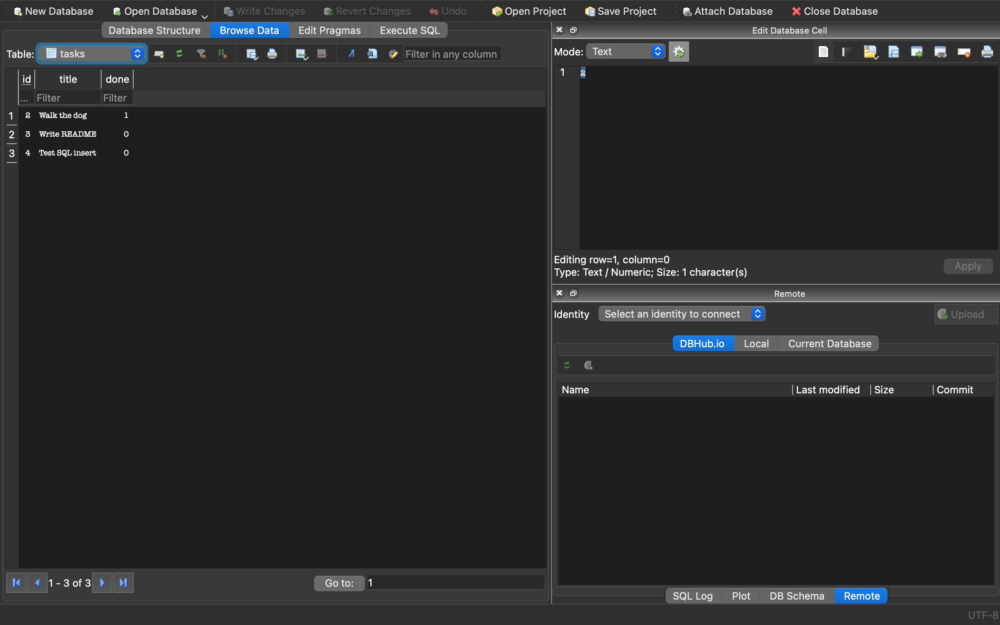

# FlyRank BE-02 — Connecting your CRUD to the database

A task CRUD API built with FastAPI, migrated from an in-memory list to a real SQLite database. The API's endpoints, request bodies, and responses are unchanged from the in-memory version — only the storage layer moved from memory to disk.

## Why SQLite

Postgres and similar databases require a separate server — installing it, starting it, creating a username and password, and connecting to it before you can even begin. SQLite needs none of that. It's just a single file (`tasks.db`) that gets created automatically the first time the app runs, with no server, no install, and no credentials to manage.

## Where the database lives

The database is a single file, `tasks.db`, created automatically in the project root the first time the app runs. It's git-ignored, so a fresh clone starts empty and regenerates the database (with three seeded example tasks) on first launch.

## How to run this project

```bash
git clone https://github.com/barak-hub/flyrank-be02.git
cd flyrank-be02
python3 -m venv venv
source venv/bin/activate
pip install -r requirements.txt
python3 -m uvicorn main:app --reload
```

The API will be running at `http://localhost:8000`.

## Endpoints

| Method | Path | Description |
|---|---|---|
| GET | `/tasks` | List all tasks |
| GET | `/tasks/{id}` | Get one task |
| POST | `/tasks` | Create a task |
| PUT | `/tasks/{id}` | Update a task |
| DELETE | `/tasks/{id}` | Delete a task |

## Exploring the database by hand

The database can be opened directly in [DB Browser for SQLite](https://sqlitebrowser.org/) — no need to go through the API. Changes made there are picked up by the running API immediately, with no restart, since both are reading the same file.



**Example query:**
```sql
UPDATE tasks SET done = 1 WHERE id = 2;
```
This marked task 2 ("Walk the dog") as completed directly in the database. After clicking "Write Changes" in DB Browser, calling `GET /tasks` through the running API immediately showed `"done": true` for that task — with no server restart required.

## What changed vs. what didn't

- The API's routes, request bodies, and response shapes are identical to the in-memory version.
- Only the storage layer changed: an in-memory Python list became a SQLite database accessed through parameterized SQL queries.
- All queries use `?` placeholders instead of string formatting, to avoid SQL injection.
